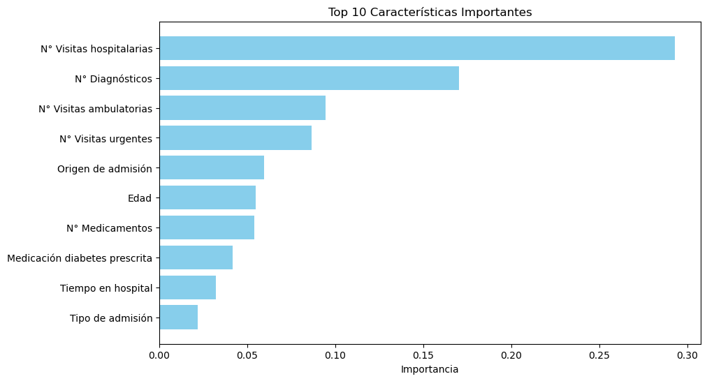
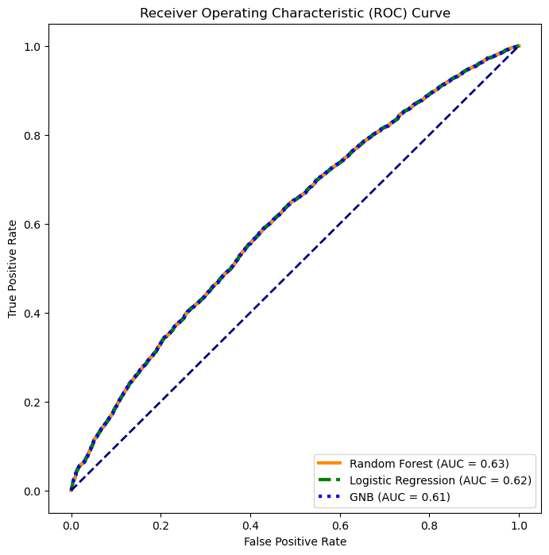

# Reingresión Hospitalaria en Pacientes con Diabetes

Predicción de reingreso hospitalario en pacientes diabéticos usando el dataset público *Diabetes 130-US Hospitals* (UCI, 1999–2008). El objetivo es clasificar si un paciente volverá a ser hospitalizado tras su alta, a partir de variables clínicas y de historial médico.

---

## Pipeline

**1. Limpieza de datos**
- Eliminación de columnas con alto porcentaje de valores faltantes (`Peso`: 97%, `Código pagador`: 52%)
- Eliminación de registros duplicados por paciente (se conserva solo el primer encuentro)
- Exclusión de pacientes fallecidos o derivados a cuidados paliativos, para evitar sesgo en la variable objetivo

**2. Transformación de variables**
- Renombre de columnas al español para mayor legibilidad
- Descategorización de variables ordinales (edad, test de glucosa, hemoglobina A1C, medicamentos)
- Codificación de diagnósticos usando categorías ICD-9
- Reducción de cardinalidad mediante binning (top-N categorías + "otros") en variables como especialidad médica, raza y diagnósticos

**3. Selección de features**
- Variables categóricas: test chi-cuadrado (umbral p < 0.4)
- Variables numéricas: correlación de Spearman (umbral p < 0.4)

**4. Modelado**
- División 80/20 (train/test) con semilla fija
- Normalización con `StandardScaler`
- Búsqueda de hiperparámetros para Random Forest con `Hyperopt` (TPE, 100 evaluaciones, optimizando F1-score)
- Comparación de tres modelos de clasificación

---

## Modelos evaluados

| Modelo | AUC-ROC |
|---|---|
| Random Forest | 0.63 |
| Regresión Logística | 0.62 |
| Gaussian Naive Bayes | 0.61 |

---

## Resultados

Las variables con mayor peso predictivo según el Random Forest fueron el **N° de visitas hospitalarias previas** y el **N° de diagnósticos**, seguidas por visitas ambulatorias y urgentes.

---

## Stack

`Python` `pandas` `NumPy` `scikit-learn` `Hyperopt` `SciPy` `Matplotlib` `Seaborn`

---

## Datos

Dataset: *Diabetes 130-US Hospitals* (UCI, 1999–2008) · 101,766 encuentros clínicos · 50 variables originales
